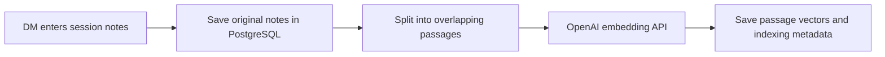
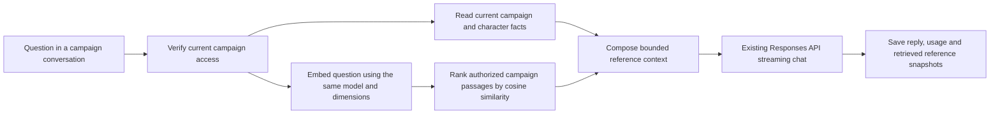

# Campaign RAG

RAG means **retrieval-augmented generation**. Before asking the model to answer, the application finds relevant campaign records and includes them in the request. This does not train or fine-tune the model. PostgreSQL remains the source of truth; the AI has no direct database access and cannot change campaign data.

This implementation treats a "session" as one play meeting. `SessionNumber` identifies that meeting. If "season" means a group of sessions, add season metadata later without replacing the ingestion/retrieval flow.

## Running without OpenAI

`OpenAI:ApiKey` is optional for startup. Keep database and JWT configuration in place: login, campaigns, characters, items, inventories, maps, text session notes, saved conversations and the read-only MCP tools remain available without AI credentials. Provider clients and the map indexing worker are registered only when the key is nonblank. This keeps credentials on the server as described in the [official OpenAI authentication documentation](https://developers.openai.com/api/reference/overview).

Without a key, `/api/ai/status` reports `configured: false`. Chat sending/streaming and audio transcription return HTTP 503 with a configuration message; rejected chat requests do not add messages. The chat page disables sending and explains the unavailable feature. Text notes remain saved with a pending index; explicit note-index requests return 503. Map saves and retries retain pending revisions without claiming leases or failing jobs.

To enable AI, set `OpenAI:ApiKey` through .NET User Secrets or `OpenAI__ApiKey` in the server environment, then restart the API. The map worker resumes pending maps automatically. Use Retry to index text notes saved while AI was unavailable. A configured key is not a guarantee that it is valid or that the provider is reachable; existing provider-error handling still applies.

## Try it

### Campaign maps

See the [map guide](maps.md) for UI behavior, upload limits, API fields and migrations.

Management cards request the authorized `/api/campaigns/{campaignId}/maps/{mapId}/thumbnail` endpoint only after becoming visible. Previews are JPEGs bounded to 640 pixels on their longest side and 100,000 bytes, with aspect ratio and JPEG orientation preserved. Originals remain available through `/image` for viewing and editing. `CampaignMapThumbnails` adds a nullable preview column without rewriting original images: new uploads store previews, and existing maps generate and cache theirs on first preview access. Replacing an image replaces its preview. Cached preview queries select only the preview bytes, and failed previews never fall back to downloading the original. SkiaSharp and its Linux native assets provide image processing; decoding is limited to 64 million pixels after any codec-supported downsampling. Invalid or unsupported uploads return a validation error, while older images that cannot generate previews remain available through the full-image endpoint.

Open **Maps** from a campaign card. Players see map images, location descriptions and pins directly, without a View maps button or indexing status. The campaign owner with the DM role has **View maps** and **Manage maps** tabs for adding, editing, deleting and reindexing maps. Management starts with preview cards, with three cards per row on wide screens, six reserved spaces, and a vertically scrollable list for additional maps. Only the next available card contains Add map, including when all six spaces are occupied. Narrow screens use fewer columns in the same bounded area. Indexing status and retry remain available on management cards. Add map or Edit replaces the card list with a single form. Saving or canceling returns to the list; failed saves retain the form and draft for correction. Full-size map display stays in the viewer/editor while cards use small previews. Edit, location and other management actions use the shared button component. All map content is shared; this version has no DM-private maps or locations.

Map names must be unique within a campaign, ignoring capitalization and surrounding spaces. Different campaigns may reuse a name. Create and rename requests return HTTP 409 with a readable error on conflicts. Campaign row locks serialize name checks, and a database unique index on `(CampaignId, NormalizedTitle)` enforces the rule. The `UniqueCampaignMapNames` migration backfills normalized titles; if existing names conflict, it preserves the oldest map's name and suffixes newer maps with `(duplicate ID)`, adding a counter if that suffix already exists. Renamed maps are marked pending for reindexing; images and locations are preserved. Rolling back this migration removes the constraint but does not undo these renamed titles.

A map requires a title, a PNG/JPEG/WebP image up to 50,000,000 bytes (50 MB), and 1–50 named locations. Create/update requests allow 51,000,000 bytes to accommodate multipart metadata. Add descriptions to explain what each location means. Select a location and click the image to place its numbered pin, or enter X/Y percentages directly. Editing can replace the image, update the descriptions, or add/remove locations; omitting a replacement retains the current image. Deletion removes the image and derived search chunks. Previously stored chat source snapshots remain as historical references.

Choose **Add location** after entering its details to collapse it into a read-only card. **New location** opens another location form. **Edit location** reopens an added location and enables moving its pin; **Save location changes** confirms edits and **Cancel location** restores its previous values. Existing locations start read-only when editing a map. Choose **Save map** to persist all location changes and refresh RAG indexing.

Every map pin is a general campaign place/location. It does not need a town/city label to appear in general location questions. For specific requests mentioning towns, cities or villages, chat receives a current catalog filtered by those explicit whole words in each location's name or description, ignoring capitalization and accepting plurals. A map title does not classify its pins; `Downtown ruins` does not match `town`. If multiple types are requested, the catalog includes locations matching any requested type. This is literal labeling, so phrases such as `not a town` still contain the town word; it does not infer settlement type from geography or synonyms.

The catalog is read directly from authorized campaign map records and remains available even if embeddings fail. It avoids treating the four most similar passages as a complete list. It includes at most 200 maps and 200 matching locations, within a 20,000-character catalog budget; descriptions are capped at 1,000 characters while type matching uses the full name and description. Omission/truncation metadata is supplied, and the model is instructed to disclose incomplete lists and to use this catalog for current map-location lists. Semantic passages continue supplying narrative context. No reindexing or migration is needed for this behavior change. Provider-free database checks cover general locations, town/city filtering, campaign isolation and embedding failure fallback; actual model compliance is not guaranteed by those checks.

Map titles, descriptions and locations are chunked and embedded through the existing `IEmbeddingService`. Map passages and session passages compete in the same campaign-scoped cosine ranking and share the existing four-passage/2,000-chunk bounds. Chat references distinguish maps from sessions. Images are **not** sent to a vision model or embedded; the model can answer from the DM-authored text, not inspect image labels or infer roads, distances, or compass bearings from pins. This follows the [official text embedding guidance](https://developers.openai.com/api/docs/guides/embeddings).

Map saves and retries commit source changes and a pending index revision, then return immediately. `MapIndexingWorker` polls persisted pending jobs every two seconds, claims a five-minute lease with an atomic update, and calls embeddings outside any database transaction with a two-minute timeout. Only the final chunk replacement uses a short transaction. Revision and lease checks discard late results after newer edits, retries or deletion. Expired leases recover work after a crash; graceful cancellation releases the lease. Failures preserve the source with a retry status. Pending/failed maps are excluded from semantic retrieval so old chunks cannot supply stale facts; current location catalogs remain available. The management page polls pending status every three seconds without refetching unchanged preview cards. Retrying an already pending job is idempotent.

The additive `BackgroundMapIndexing` migration stores revision and lease fields while preserving existing ready indexes. `tests/MapIndexingChecks` uses committed fixtures and fake providers on separate database connections to check lock availability, stale results, failures, recovery and deletion. Its temporary account/campaign is removed in cleanup. Session-note indexing still uses its existing request-based implementation; this change applies to maps.

Images are bounded PostgreSQL `bytea` blobs, served through the authenticated campaign image endpoint and fetched through the existing Axios client. They are not public static assets. Upload validation checks file size and PNG/JPEG/WebP signatures and requires successful preview decoding; corrupted or unsupported-dimension uploads are rejected. Storing blobs keeps this first slice self-contained, but object storage would reduce database/backup growth at larger volume. Map embedding costs are not included in the displayed chat dollar estimate.

`20261007004325_CampaignMaps` adds `CampaignMaps` and `MapKnowledgeChunks`, with cascade deletion and a unique map/position index. It preserves existing campaign records and is applied by normal API startup. Thumbnail processing uses SkiaSharp and its Linux native assets; existing authentication remains in place.

Main map files: `CampaignMapsController.cs`, `MapDtos.cs`, `CampaignMap.cs`, `MapKnowledgeService.cs`, `Maps.tsx` and `mapsApi.ts`. Shared retrieval, source DTOs, chat reference rendering, routing, DbContext and DI are extended for map sources.

Verification commands:

```powershell
dotnet build DnDCampaignManager.sln -p:UseAppHost=false -p:OutputPath=bin/MapSolutionVerification/
dotnet build tests/CampaignMembershipChecks/CampaignMembershipChecks.csproj -c MapVerification -p:UseAppHost=false
dotnet tests/CampaignMembershipChecks/bin/MapVerification/net8.0/CampaignMembershipChecks.dll DnDCampaignManager.Api
dotnet ef migrations has-pending-model-changes --project DnDCampaignManager.Api --configuration MapVerification --no-build
# From DnDCampaignManager.web:
npx tsc -b
npx vite build --outDir dist-map-verification
npx eslint src/pages/Maps.tsx src/api/mapsApi.ts src/pages/AIChat.tsx src/App.tsx src/components/CampaignItem.tsx
node --test tests/maps.test.cjs tests/campaignRag.test.cjs
```

Database checks use fake provider vectors, apply pending migrations, and roll back test fixtures. UI checks exercise multipart contracts, multiple location pins, failed-index retry, and player read-only rendering. They do not evaluate real embedding quality or constitute a manual browser layout check.

1. Restart the API with your existing configuration. Startup applies pending migrations. DMs and players can use only their own campaign chats for campaigns they own or belong to. Legacy general chats remain saved but inaccessible.
2. On the dashboard, open **Session Notes** for a campaign you own as DM.
3. Enter a session number, date, title and narrative. For example: "Freya found a silver key beneath the ruined tower. The party promised Captain Mira they would investigate the abandoned mine."
4. Save. **Searchable** means the notes and embeddings were saved successfully. **Not searchable yet** means the original notes are saved but the DM needs to retry indexing.
5. Open **AI chat** and select a campaign in **Campaign chat**. Selecting a campaign opens your existing personal chat or creates it on first use. The selected campaign, displayed messages and retrieved context always correspond to that chat.
6. Ask "Where did we find the silver key?" or "What did we promise Captain Mira?" Expand **Retrieved session references** to inspect the actual passages supplied to the model.
7. Ask about a character's current HP. Editing the character sheet changes the next answer's structured context immediately; it does not require reindexing notes.

All session notes in this first version are shared with campaign members. Do not enter DM-only secrets. Only the campaign owner with the DM role can create, reindex or delete notes. Players can read notes and use campaign chat. This deliberately follows the existing ownership/membership rules.

Neither players nor DMs have a general-chat option. Initialization opens a chat in the first accessible campaign. Users with no campaigns receive an empty state. API checks deny listing, reading, clearing or sending messages to legacy general chats for all users. There is one personal chat per user per campaign; membership does not expose other users' transcripts. **Clear chat** removes messages but retains the campaign chat. Repeated creation requests return the existing chat, with a database unique index and serialized creation protecting against duplicate requests across tabs.

## How campaign conversations participate in RAG

Every message in a campaign conversation already uses the retrieval pipeline: relevant session passages, fresh campaign/character facts, and up to 30 recent messages from that conversation are supplied to the model. Conversation history supplies short-term context; the session index supplies campaign knowledge across conversations.

Chat transcripts are not automatically embedded as campaign facts. Hypothetical questions and generated suggestions must not silently become established campaign history. The recommended next step is a DM-reviewed summary workflow: draft a summary from a conversation, approve/edit it as a session note, then index that approved note. This would make useful chat outcomes retrievable without treating every generated statement as authoritative. That summary workflow is not implemented yet.

## Create session notes from a recording

The campaign DM can choose **Start from an audio recording**, select a file and click **Transcribe audio**. The API verifies campaign ownership before calling the transcription provider. The resulting text fills the session draft; it does not enter campaign knowledge until the DM reviews it and clicks **Save session**. Fill in the session number, date and title as usual. Correct character/NPC names and remove out-of-game conversation or DM secrets before saving. No automatic summary or invented event extraction is performed.

The flow is: **audio upload → speech-to-text → reviewed session text → existing chunks/embeddings → campaign retrieval**. Audio itself is not embedded. Fresh character stats still come from database queries. The uploaded recording is not retained as an attachment or made available for playback; only the saved text is retained in PostgreSQL. Framework upload buffers are request-scoped. If playback/archive is needed later, add protected object storage and session attachment metadata rather than putting recordings in public `wwwroot` or database blobs.

This slice supports MP3, M4A, WAV, WEBM, MPEG and MPGA, up to 25,000,000 bytes per file. The multipart request limit allows additional form overhead. The application validates file extension and size; the provider validates/decodes the actual media. No video frames are processed, and automatic video-to-audio extraction is not implemented. Transcription uses the existing OpenAI key and `OpenAI:TranscriptionModel`, defaulting to `gpt-transcribe`, following the [official file transcription guide](https://developers.openai.com/api/docs/guides/speech-to-text). Transcription is billed separately from generation and embeddings, and is not included in the chat cost counter.

Use compressed audio or separate recording parts for files above the limit. Multiple notes can share a session number. Automatic splitting, live microphone recording, speaker labels, background transcription jobs and progress percentages are future work. Processing runs within the request with a ten-minute provider timeout, so long recordings may exceed hosting/proxy limits. Keep the original recording until its transcript is saved. The browser preserves an existing draft if transcription fails and asks before replacing a nonempty draft.

Session text now supports up to 240,000 characters, with embeddings generated in batches of at most 32 passages. A transcript exceeding that limit must be split. All batches must succeed before replacing the existing index; provider failures retain source notes for retry. This change requires no database migration because the existing content column is PostgreSQL `text`.

## Ingestion: turn notes into searchable knowledge



An **embedding** is a list of numbers representing text for similarity comparisons. Similar meanings tend to produce similar vectors. We split long notes into passages so retrieval can send a focused excerpt instead of the whole campaign history. Passages are up to 1,000 characters with 150 characters of overlap to retain context near boundaries; Unicode surrogate pairs are preserved. This is a conservative character-based baseline, not a token-aware or document-structure-aware chunker.

`CampaignSessionNote` stores the original narrative, campaign, session number, played date, title and indexing state. `CampaignKnowledgeChunk` stores derived passage text, its position and embedding. The index can be rebuilt from the original notes.

Saving happens before indexing. Provider failures set the note to `failed` without losing its content. A cancelled request can leave it `pending`, which can also be retried. Reindexing is serialized with a PostgreSQL row lock, replaces existing chunks, and records the model and dimensions used. Source notes are immutable in this slice; correct a note by deleting it and adding a replacement. Multiple entries may share a session number. Delete removes the note and its derived chunks.

Indexing currently runs within the save request. That keeps the flow understandable for small notes, but a reliable background job/outbox is the next step for larger imports and automatic retries. A network failure after saving can mean a note was saved even when the browser reports failure; reload the list before resubmitting.

## Retrieval and answering



The retrieval query filters by campaign in SQL **before** loading vectors. Membership is checked when creating a scoped conversation, listing/loading conversations, sending a question and building retrieval context. Revoked members cannot continue reading or querying those campaign conversations. General chats are inaccessible. A conversation's campaign association cannot be changed after creation.

Session passages are ranked by cosine similarity. Up to four passages above the configured threshold are supplied to the model. A score is a ranking signal, not a probability that the answer is correct. If nothing passes the threshold, the context explicitly says no relevant passages were found. If search fails, chat still receives current campaign and character facts and displays a warning that session search was unavailable.

Current campaign and character fields are read through an explicit allowlist: identity, ability scores, combat stats, HP, saving throws, skills and attacks. Account data such as emails, password hashes and refresh tokens are excluded. Campaign catalogs and character inventories are implemented in the application (see [items and inventories](items.md)), but their contents are not included in this shared structured context or embedded. The read-only `GetCharacterInventory` tool reads current inventory on demand with the inventory API’s stricter access rules. NPC and quest models are not implemented. Structured facts describe current state; session notes describe past events. This avoids embedding mutable stats and accidentally answering from stale character snapshots.

Reference text is sent as data with developer instructions to ignore instructions embedded inside it, use current structured facts for stats, cite session facts with labels such as `[S1]`, and acknowledge missing evidence. This reduces prompt-injection risk but does not guarantee model compliance. The model can use the authorized [read-only campaign and character tools](AI_TOOLS_AND_MCP.md); it has no application write access.

Replies store the **retrieved** excerpts and source labels as snapshots. They survive reloads and later note deletion. These references show what was supplied to the model; they do not prove that the model used every passage or that every claim is supported. For automated confidence, the next step is an evaluation set of campaign questions and expected evidence.

## Components and configuration

- `CampaignSessionNotesController`: authenticated REST operations with DM ownership checks and request validation.
- `CampaignKnowledgeService`: indexing, campaign authorization, structured context and semantic retrieval.
- `IEmbeddingService` / `OpenAIEmbeddingService`: isolates the provider and makes the pipeline testable without paid API calls.
- `KnowledgeText`: overlapping chunking and cosine scoring.
- `AIChatController` / `OpenAIService`: retain the current streaming path and add authorized context plus persisted references.
- `SessionNotes.tsx` / `sessionNotesApi.ts`: note entry, status, retry and deletion.
- `AIChat.tsx` / `aiApi.ts`: campaign selection for new chats and reference/warning display.
- `DnDxDbContextFactory`: lets EF design-time commands run without starting the API or requiring an OpenAI key.

The existing OpenAI .NET SDK already supports embeddings; no additional packages or services were introduced. Use the same `OpenAI:ApiKey` from User Secrets or environment configuration. Non-secret defaults are in `appsettings.json`:

```json
{
  "OpenAI": {
    "EmbeddingModel": "text-embedding-3-small",
    "EmbeddingDimensions": 512
  },
  "Rag": {
    "MinimumSimilarity": 0.25
  }
}
```

Stored passages and questions must use the same model and dimensions. Changing configuration requires reindexing existing notes; incompatible notes are excluded and produce a warning. The threshold is a starting point and should be tuned against actual campaign questions.

Chat input/output token counts still come from the Responses API, including the reference context sent to the model. Query embedding tokens appear separately on the reply; note-index embedding tokens appear on the note. The existing displayed dollar total estimates generation cost only and does **not** include embedding charges. A note's displayed embedding usage records the latest successful indexing run, not cumulative costs across retries.

## Storage and scaling decision

The repository uses PostgreSQL/Npgsql for development and deployment, matching `AGENTS.md` and the API configuration. Vectors are stored as native PostgreSQL `real[]` arrays and similarity is calculated inside the API. This avoids requiring a new database extension or Docker image change for the first working pipeline.

This is an exact scan for a small development dataset, not a production vector index. Retrieval supports up to 2,000 compatible chunks per campaign. Above that limit it explicitly disables session retrieval with a warning rather than silently ignoring older notes. Current context supports up to 40 characters and 20 attacks per character, with a 50,000-character structured context limit. Larger campaigns need targeted structured tools and better context budgeting.

When usage grows, replace the scan with PostgreSQL **pgvector** and database-side similarity/indexing while retaining campaign filters and the service boundary. Add background ingestion before large document imports. A future reusable read-only `SearchCampaignKnowledge` tool can join the existing `GetCharacter`, `ListCharacters` and `GetCampaignState` tools. Tool calling, agents and MCP can reuse these application services and authorization checks; they should not bypass them or receive unrestricted database access. DM-private notes require explicit visibility metadata and filtering in listing, indexing, retrieval and retained chat references before they can be supported.

## Migration and verification

`20261005030847_CampaignSessionRag` adds two tables, optional campaign scope on conversations and retrieval metadata on messages. Existing messages receive `SourcesJson = "[]"`. It does not drop or recreate the development database.

Build and checks:

```powershell
dotnet build DnDCampaignManager.sln -p:UseAppHost=false -p:OutputPath=bin/SolutionVerification/
dotnet build DnDCampaignManager.Api/DnDCampaignManager.Api.csproj -c RagVerification -p:UseAppHost=false
dotnet ef migrations has-pending-model-changes --project DnDCampaignManager.Api --configuration RagVerification --no-build
dotnet build tests/CampaignMembershipChecks/CampaignMembershipChecks.csproj -c RagVerification -p:UseAppHost=false
dotnet tests/CampaignMembershipChecks/bin/RagVerification/net8.0/CampaignMembershipChecks.dll DnDCampaignManager.Api
```

The console checks connect to the configured development PostgreSQL database and apply pending migrations first. Temporary fixtures are created inside a transaction and rolled back. Provider calls use fakes; tests cover indexing failure/retry, source retention, semantic ranking, access restrictions, campaign isolation, live character edits and the real SSE contract. They do not measure real embedding quality or model grounding.

From `DnDCampaignManager.web`:

```powershell
npm run build
node --test tests/characterRequest.test.cjs tests/campaignCharacterCreation.test.cjs tests/campaignInvite.test.cjs tests/aiStream.test.cjs tests/campaignRag.test.cjs
npx eslint src/pages/SessionNotes.tsx src/pages/AIChat.tsx src/api/sessionNotesApi.ts src/api/campaignApi.ts src/api/aiApi.ts src/components/CampaignItem.tsx src/App.tsx
```

Official references used: [OpenAI embeddings](https://developers.openai.com/api/docs/guides/embeddings) and [retrieval](https://developers.openai.com/api/docs/guides/retrieval). The latter explains semantic retrieval and OpenAI-managed vector stores; this implementation keeps its own campaign-scoped storage in PostgreSQL.

`20261005045716_OneChatPerCampaign` enforces unique `(UserId, CampaignId)` pairs for scoped chats. Before creating the index, it merges duplicate campaign chats into the oldest chat ID, moves every message there, and preserves the latest update timestamp. Old general chats remain stored. Rolling back the index does not split merged histories again. No database reset is required.

Chat reference context, history, serialized requests, reply tokens and provider durations now have explicit [budgets and deadlines](AI_LIMITS.md).
